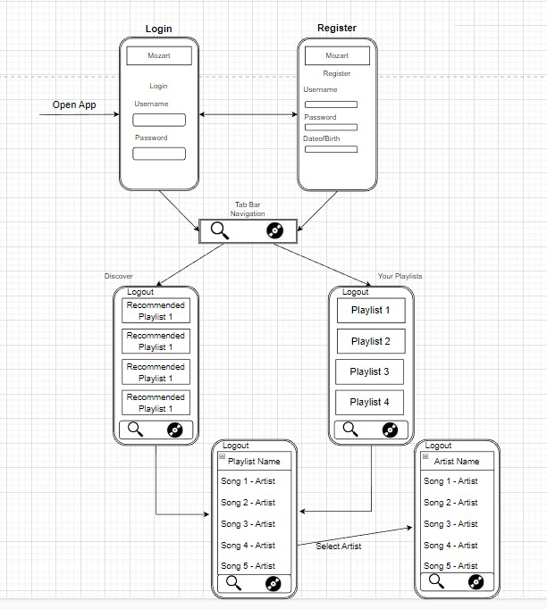
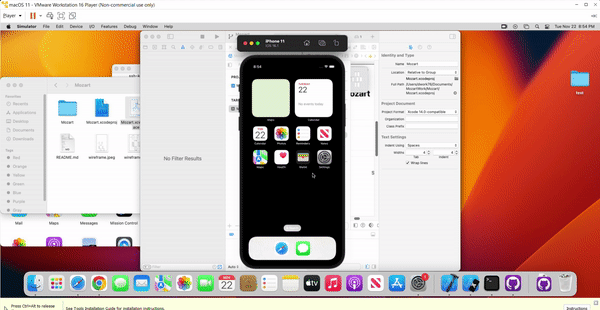

Original App Design Project - README Template
===

# Mozart


## Table of Contents
1. [Overview](#Overview)
1. [Product Spec](#Product-Spec)
1. [Wireframes](#Wireframes)
2. [Schema](#Schema)

## Overview
### Description
This is application is going to be a music app that is inspired by spotify. It will sync the users playlist from sptofiy. It will also allow the user to find new music. 

### App Evaluation
[Evaluation of your app across the following attributes]
- **Category:** Music/Streaming
- **Mobile:** The application will be displayed.
- **Story:** Allows to acess spotify playlist. Create and add music to playlist. Sync playlist to spotify. The user will be able to search up artist. 
- **Market:** Anyone that likes to stream music. 
- **Habit:** Users can listen to as many songs as they like, ad-free, from their playlist or from a selected artist. Users can create new playlists and add as many songs as they want to them. 
- **Scope:** This app will aim to be focused on streaming music, adding songs to playlists and viewing artists discography.

## Product Spec

### 1. User Stories (Required and Optional)

**Required Must-have Stories**

* click on artist/username to be taken to their profile page
* sync spotify profile playlist
* can listen to songs on spotify
* user can add songs to playlists
* login / logout
* stay signed in between sessions
* pull spotify recommended playlists 
* ...

**Optional Nice-to-have Stories**

* genre labels for songs & album
* ability to see album that the song appears on
* search songs from spotify database/api
* search albums from spotify database/api
* ...

### 2. Screen Archetypes

* Register Screen
    * sets users infomation to database
* Login Screen
    * login / logout
    * stay signed in between sessions

* Discover Music/Playlists
    * Disover Music is Playlsit that is recommend by Spotify
* Your Playlists
    * sync spotify profile playlist
    * user can add songs to playlists
* Playlists
    * playlist is list of the songs
    * contains artist names and songs
* Artist
    * list of songs 

### 3. Navigation

**Tab Navigation** (Tab to Screen)

* Your Playlists
* Discover new playlists (populated from Spotify API)
* logOut

**Flow Navigation** (Screen to Screen)

* Login/Register
   * Login has register button <-> Register has login button
   * once logged in, it takes you to -> Your Playlists
   * text box for user name and password
   * date of birth is add for registor
* Your Playlists 
   * Is connected to a tab navagation bar to acess -> Discover
   * logout button takes to -> login screen
  
* Discover
   * Is connecte to a tab navagation bar to acess discover
   * Once a playlist is tapped it takes it to -> playlist screen
   * logout button takes to -> login screen

* Playlist
   * Playlist opens up the list of songs contain.
   * If you click on name it takes you to -> Artist
   * logout button takes to -> login screen
* Artist
   * logout button takes to -> login screen


## Wireframes
[Add picture of your hand sketched wireframes in this section]


### [BONUS] Digital Wireframes & Mockups

### [BONUS] Interactive Prototype

## Schema 
[This section will be completed in Unit 9]
### Models
[Add table of models]
* User

| Property | Type | Description |
| -------- | -------- | -------- |
| Username | String | User name set to database |
| Password | String | Password to account |

* Song

| Property | Type | Description |
| -------- | -------- | -------- |
| URI | String | URI of the track |
| Name | String | Name of song |
| Artist | SPTAppRemoteArtist | Artist of song |
| Album | SPTAppRemoteAlbum | Album of song |
| Saved | Bool | Is song saved |
| Episode | Bool | Is song episode |
| Podcast | Bool | Is song podcast |

* Playlist

| Property | Type | Description |
| -------- | -------- | -------- |
| added_by.ID | String | User who added song |
| track | String | Name of song |
| href | String | URI of the track |
| Album | SPTAppRemoteAlbum | Album of song |

* Artist

| Property | Type | Description |
| -------- | -------- | -------- |
| URI | String | URI of the artist |
| Name | String | Name of artist |

### Spotify
    * Base Url  https://api.spotify.com

| HTTP Verb | Endpoint | Description |
| -------- | -------- | -------- |
| Get | /me/playlist | Get user playlist list string |
| Get | /me/playlist/{playlist_id}/tracks | Get user playlist tracks string |
| Get | /tracks/{id} | Get tracks information|
| Get | /artists/{id} | Get artist name on the track|
| Get | /playlists/{playlist_id} | Get playlist that is not users|
| Get | /browse/featured-playlists | Get featured playlists|


### Networking
- Login
    - (Read)Match User Password and Login
        
        ```swift
          @IBAction func Signin(_ sender: Any) {
        let username = UsernameField.text!
        let password = PasswordField.text!
        
        PFUser.logInWithUsername(inBackground: username, password: password) { (user, error) in
            if user != nil {
                self.performSegue(withIdentifier: "loginSegue", sender: nil)
            }
            else{
                print("Error: \(error?.localizedDescription) ")
            }
        }
        }

         ```
         
- Register
    - (Create)Register User in Database
    ```swift
        @IBAction func Signup(_ sender: Any) {
        
        let user = PFUser()
        user.username = UsernameField.text
        user.password = PasswordField.text
        
        user.signUpInBackground { (success, error) in
            if success{
                self.performSegue(withIdentifier: "loginSegue", sender: nil)
            }
            else
            {
                print("Error: \(error?.localizedDescription) ")
            }
        }
        }

    ```
- Discover
    - (Get/Read)Get Playlist from Spotify API
    - (Get/Read)Get image of Playlist
- Your Playlists
    - (Get/Read)Get your Playlist from Spotify API
    - (Get/Read)Get Image of Playlist
- Playlist
    - (Get/Read)Get List of Songs from Playlist
    - (Get/Read)Get Artist Name
- Select Artist
    - (Get/Song Names)Get Name 
- [Add list of network requests by screen ]
- [Create basic snippets for each Parse network request]
- [OPTIONAL: List endpoints if using existing API such as Yelp]

* First gif:


* Second gif:



